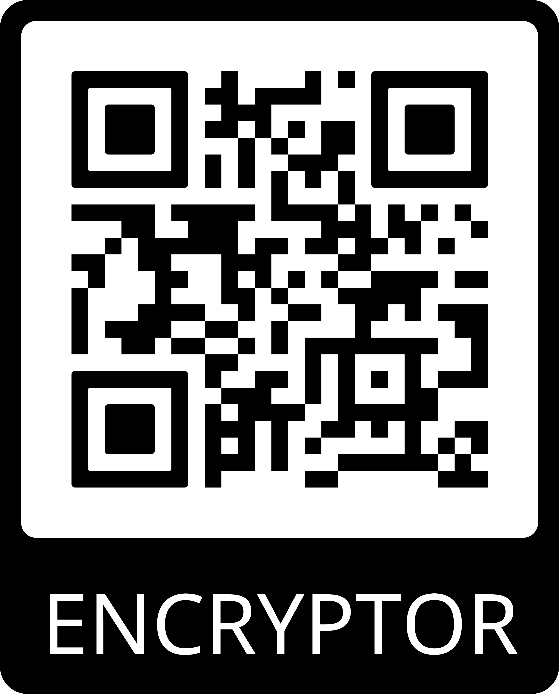

# Encriptador-Alura
Encriptador de texto para compartir mensajes secretos.

Las "llaves" de encriptación que utilizaremos son las siguientes:

La letra "e" es convertida para "enter"
La letra "i" es convertida para "imes"
La letra "a" es convertida para "ai"
La letra "o" es convertida para "ober"
La letra "u" es convertida para "ufat"

<h2>Reglas del proyecto:</h2>
<ul>
  <li>Debe funcionar solo con letras minúsculas</li>
  <li>No deben ser utilizados letras con acentos ni caracteres especiales</li>
  <li>Debe ser posible convertir una palabra para la versión encriptada también devolver una palabra encriptada para su versión original.</li>
</ul>

<h2>Tecnologias Utilizadas:</h2>
<ul>
  <li>HTML5</li>
  <li>CSS</li>
  <li>JavaScript</li>
</ul>
